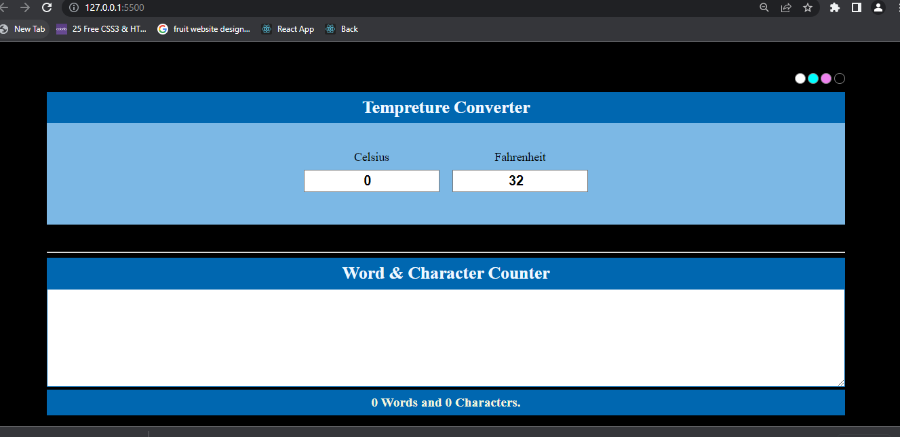
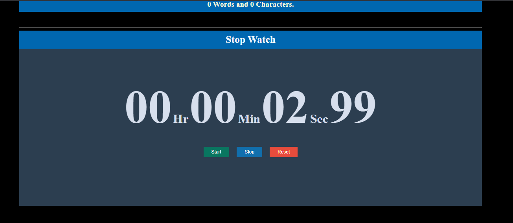
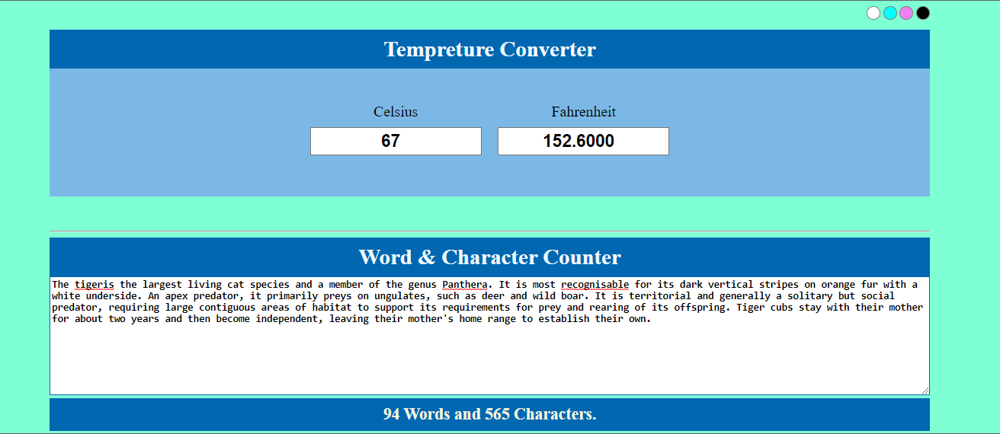
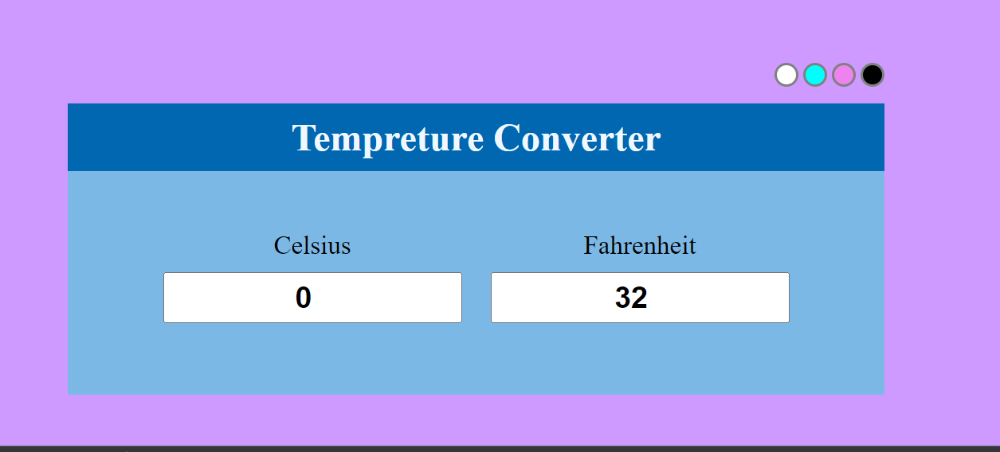

# Convertor Project.

## Poject Desrciption:

Convertor Project is a web Application  made of using pure JavaScript's  with HTML & CSS. In this application having Three sections in each sections we can perform operations like:- Temperature Convertor, Word & Character Counter and Stop Watch. And having Color theming when click on any color it will change background Color.This Website is fully responsive. 

## Technology Used:

- JavaScript :- JavaScript is the Programming Language for the Web. JavaScript can update and change both HTML and CSS. JavaScript can calculate, manipulate and validate data.
- HTML: Hyper Text Markup Language is the standard markup language for creating Web pages, describes the structure of a Web page it consists of a series of elements that tell browser how to display the content.
- CSS: CSS is the language we use to style an HTML document & describes how HTML elements should be displayed.

## What I've Learnt :
- HTML how to write Html, learn different tags etc.
- How to apply CSS with class and Id. and their syntax.
- How to make fully responsive website using media Query.
- Writing clean, structure Consistence code.
- Theming to change color of background.
- button on Click events, DOM events, etc.
- how to debug and identifying error and also resolve it.
- proper CSS without using float, and not play with max to max margin & padding.

## Getting Started with Project

### `To start`

One Can use Live server. to run this project.
Live Server: It enables us to right-click an HTML document, and it runs a server for us and opens a browser window with the file in it. Any changes we make to the file causes the browser to reload and we can immediately see them. 

### Home - Page
Home Screen
.

.
- In stop watch section when we click on Start button counter get started when click on Stop button counter get stopped, and when click on clear Reset all counter value become 00 and ready to start from first.

### Operation
Home Screen
.
- Here we can convert temperature from celsius to fahrenheit & fahrenheit to celcuis . user need to input in only on input section output will render on other input section.
- and also able to calculate word and character while typing.

### Theming Operation
Home Screen
.
- when click on any color shown in circle user can able to change its background color.

## Project Deployed
https://operation-7cfa9.web.app